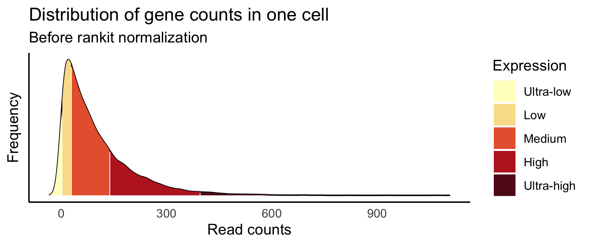
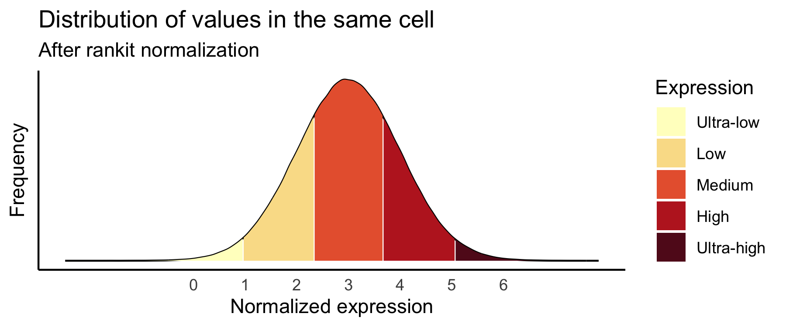

# Where's my gene documentaion

## How to interpret dotplot

The dotplot is designed to reveal gross differences in expression patterns across cell types and to highlight genes that are highly expressed in certain cell types. 

Genes that are lowly expressed or expressed in a small percentage of cells are difficult to visually  identify in a dot plot. This is particularly important for certain marker genes that are specifically but lowly expressed in their target cell types, for example transcription factors and receptors.

Given that data are quantile normalized, all expression is relative to the cells it is measured in. As such comparisons of absolute expression across cell types could be made if the number of genes measured is equal across all cells. While this assumption is violated, we attempt to minimize negative effects by excluding cells with low gene coverage (see above) thus reducing the variance in genes measured across cells. Nonetheless, caution is advised when finding subtle differences in the dot plot across cell types. 

To identify highly expressed genes, the user is advised to pay attention to both the color intensity and the size of the dot. 

Users interested in evaluating the pre-normalized absolute expression data can access it through our cell api  [TODO - insert link to cell-centric API] .

TODOs:  
- Include examples for color of what low, medium and high is.

## Cell type ordering

Cell types are annotated by the original data contributors and mapped to the closest cell ontology (CL) term as defined in the [data schema](https://github.com/chanzuckerberg/single-cell-curation/blob/main/schema/2.0.0/schema.md#cell_type_ontology_term_id). 

In some cases there are cell types annotated with a high-level term whereas in some other cases they can be very granularly annotated. For example, there are some cells annotated as "T cells" and others annotated with children terms like "effector CD8-positive, alpha-beta T cell". All of these cell types are shown in the dot plot and they should not be interpreted as one being a subset of the other.

### Ontology-based ordering

Cell types are ordered according to the CL directed acyclic graph (DAG). Briefly, for each tissue a 2-dimensional representation of the DAG containing the tissue cell types is built, then an ordered list of cell types is created by traversing the DAG using a depth-first approach.  

This method groups cell types together based on their ontological relationships thus providing a loose lineage-based ordering.

An in-depth description of this method can be found [here](./cell-type-ontology-ordering.md)

## Processing of expression data

### Removal of duplicate cells

Some data at the cellxgene portal is duplicated due to independent submissions, for example meta-analysis vs original data. All data submitted to the portal is curated to indicate whether any cell is the primary data. Only cells demarcated as primary data are included in the processing steps below.

### Removal of low coverage cells

Any cell that has less than 500 genes expressed is excluded, this filters out about 8% of all data and does not eliminate any cell type in its entirety [TODO - investigate if the are cell types systematically affected by this]. This filter enables more consistent quantile vectors used for the normalization step.

### Gene-length pre-normalization

WARNING - The following process has not been implemented as the feature **currently only includes data that does not require gene-length normalization.**

In platforms that sequence full RNA molecules, such as Smart-seq, gene counts are directly correlated with gene length. To account for this, gene counts from these technologies are divided by the corresponding gene length prior to normalization.

For each gene in our reference files, length was calculated by creating non-overlapping meta-exons across all isoforms of a gene, and then adding up their length in base-pairs. 

### Data normalization

Gene counts are normalized using the rankit method. For a given cell in a count matrix, the values are transformed to quantiles, then those quantiles are mapped to the corresponding values in the standard normal distribution. Normalized matrices from multiple datasets of the same tissue are concatenated along the gene axis.

Here is a visual representation of this method:

 

    
 

 
  

    
 

 
This method accounts for sequencing depth by standardizing gene expression within the approximate range of -3 to 3. A high gene-cell value (>2)  indicates that the gene is amongst genes that are the highest expressed in that cell, and similarly a low value (<2) indicates that the gene is amongst the lowest expressed genes in that cell. 

Rankit normalization compresses highly expressed genes to the right tail of the standard normal distribution (see above), thus providing ideal values for using a color representation of gene expression and avoiding saturation that would otherwise be present.

 [TODO - include a paragraph that mentions in what studies this type of normalization has been included] 

### Removal of noisy low expression values

After applying normalization, any gene/cell combination that had counts less or equal than 3 are set to missing data. This allows for removal of noise due to ultra-lowly expressed genes and provides a cleaner visualization.

### Summarization of data in dot plot

For each gene/cell type combination the following values are represented in the dotplot, either visually or in text upon hover.

* Relative expression (dot color) – the average rankit-normalized gene expression among genes that have non-zero values.
* Scaled relative expression (dot color) – scaled mean expression to the range [0,1]. Scaling is done by assigning the minimum value in the current view to 0 and the max is assigned to 1. 
* Expressing cells (dot size) – percentage of cells of the cell type expressing the gene, in parentheses is shown the absolute number of cells expressing the gene. These numbers are calculated after the following filters have been applied: "Removal of low coverage cells" and "Removal of noisy low expression values".